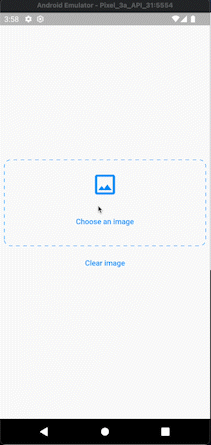

# Flutter Image Picker Example for Mobile and Web

A new Flutter example project.  In this Project, we implemented responsive image picker for both Mobile and Web.  Users can pick images using mobile and web and delete the selected image if they want.

## Packages used : 
- image_picker: [link](https://pub.dev/packages/image_picker)
- dotted_border: [link](https://pub.dev/packages/dotted_border)

**Mobile Demo**

**Web Demo**

